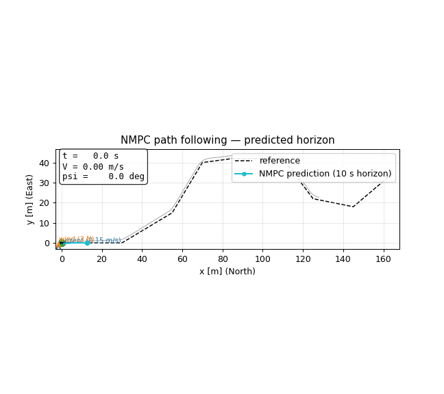
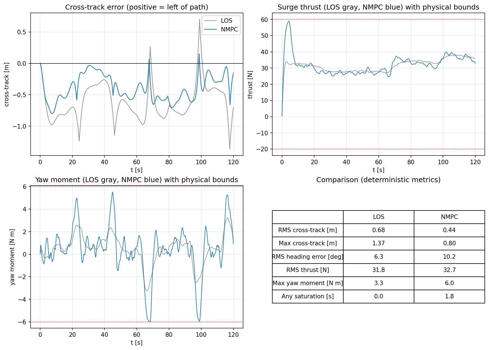
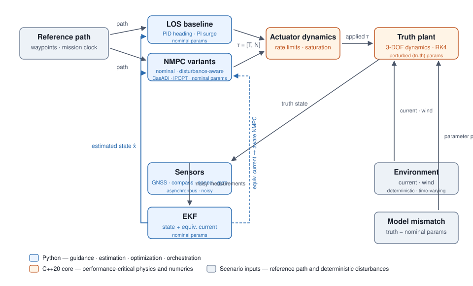

# Vessel-GNC

[](https://github.com/cdhainaut/vessel-gnc/actions)
[](LICENSE)
[](pyproject.toml)
[](CMakeLists.txt)

C++/Python simulation, estimation and nonlinear control for autonomous
surface vessels.



*An autonomous surface vessel follows a curved reference path under a steady
cross-current and beam wind. The controller runs on EKF estimates from noisy
sensors; the cyan line is the NMPC's 10 s predicted horizon, re-solved at
5 Hz.*

**3-DOF dynamics · EKF · LOS/PID · NMPC · C++20 · CasADi**

## Measured performance

| Metric | Result |
|---|---:|
| C++ RK4 propagation (vessel + actuator) | **~135 ns/step** |
| 1000 s simulation (Python loop) | **~400 ms** |
| NMPC mean / p95 solve time | **155 / 195 ms** (5 Hz budget) |

Machine-dependent; regenerate with `python benchmarks/benchmark_simulation.py`.

## Demo

The flagship scenario: an S-curve reference path under a slowly rotating
current and wind gusts — all unknown to the controllers and to the filter.
The vessel is controlled from EKF estimates only (GNSS at 5 Hz,
compass/speed/gyro at 10 Hz, all noisy), its true dynamics differ from the
controller model, and the commands reach the hull through a rate-limited
actuator with response lag (docs/model.md §5). The augmented EKF estimates
the ambient current online (example 04).

The plant runs the perturbed **truth parameters** (model mismatch) behind a
rate-limited actuator; the environment is time-varying (rotating current,
wind gusts) and the controllers and the filter use the nominal model — they
never see the true state or the true disturbance. The augmented EKF
estimates the ambient current online.

| Metric | LOS (PID/PI) | NMPC |
|---|---:|---:|
| RMS cross-track error [m] | 0.68 | **0.44** |
| Max cross-track error [m] | 1.37 | **0.80** |
| RMS heading error [deg] | **6.3** | 10.2 |
| RMS thrust [N] | **35.6** | 36.9 |
| Max yaw moment [N m] | 3.6 | 6.0 |
| Mean / p95 solve time [ms] | — | **129 / 166** |

NMPC tracks the path tighter at the price of more actuator activity; the LOS
baseline is simpler and cheaper. No cherry-picked numbers: regenerate with
`python examples/05_nmpc_demo.py` (writes `results/comparison_metrics.json`).



## Architecture



The C++20 core owns the performance-critical kernel (3-DOF dynamics, RK4
integration, PID/PI baseline controllers); Python owns guidance, the EKF,
the NMPC, orchestration and visualization. The NMPC prediction model is an
independent CasADi implementation of the same equations, cross-validated
against the C++ kernel in the tests (max diff < 1e-8).

## Uncertainty-aware control

The current demo already runs the full chain — physical model, simulation,
estimation, optimal control — under disturbances that the controllers do not
see. The next milestones make the uncertainty story explicit:

- actuator dynamics with saturation and rate limits;
- separate nominal (controller) and truth (plant) models with parameter
  mismatch;
- time-varying current and gust disturbances, estimated online by an
  augmented EKF;
- scenario-based robust NMPC propagating several model variants under one
  common control sequence;
- Monte-Carlo evaluation of LOS vs nominal NMPC vs robust NMPC.

No RL, PINNs or neural networks: the differentiator is quantitative
robustness analysis of physics-based control.

## Results

All figures are regenerated by the examples (see below) into `results/`:

- `trajectory_open_loop.png`, `open_loop.gif` — open-loop run;
- `heading_control.png` — heading step response;
- `path_following.png` + `path_following_metrics.json` — LOS baseline;
- `estimator.png` — true vs GNSS vs EKF;
- `current_estimation.png` — true vs estimated ambient current;
- `nmpc_trajectory.png`, `controller_comparison.png`, `comparison_metrics.json`
  — NMPC vs LOS;
- `assets/hero.gif` — flagship animation (committed for the README).

## Model

3-DOF horizontal-plane vessel (Fossen formulation, docs/model.md):

```text
eta = [x, y, psi]^T          nu = [u, v, r]^T
eta_dot = R(psi) nu
M nu_dot + C(nu_rel) nu_rel + D(nu_rel) nu_rel = tau + tau_env
```

With diagonal mass + added mass, Coriolis/Munk coupling, linear + quadratic
damping, relative-velocity current and inertial wind force. SI units,
radians internally. Parameters are order-of-magnitude for a small USV —
explicitly **illustrative**, not identified from a specific hull.

## Software

| Path | Responsibility |
|---|---|
| `include/vessel_gnc/`, `src/` | C++20 core: state, dynamics, integrator, controllers, pybind11 binding |
| `python/vessel_gnc/` | Simulation, guidance, metrics, sensors, EKF, NMPC, visualization |
| `examples/` | Five runnable scenario scripts |
| `tests/` | C++ (GoogleTest) and Python (pytest) tests |
| `benchmarks/` | Reproducible performance benchmarks |
| `docs/` | Model, control, estimation and validation documentation |

## Running the demo

Requirements: CMake ≥ 3.20, a C++20 compiler, Python ≥ 3.12.

```bash
pip install -e .        # builds the C++ core via CMake (scikit-build-core)
python examples/05_nmpc_demo.py    # flagship: NMPC vs LOS + hero animation
```

Other examples:

```bash
python examples/01_open_loop.py        # open-loop run + animated scene
python examples/02_heading_control.py  # heading step response
python examples/03_path_following.py   # LOS path following + metrics
python examples/04_ekf.py              # EKF estimation in the loop
```

C++-only build and tests:

```bash
cmake -B build && cmake --build build
ctest --test-dir build
```

Benchmarks:

```bash
python benchmarks/benchmark_simulation.py
cmake -B build -DVESSEL_GNC_BUILD_BENCHMARKS=ON && cmake --build build
./build/benchmark_core
```

## Validation

- 28 C++ tests + 30 Python tests (see `docs/validation.md` for the full
  record, case by case);
- analytical and convergence validation (RK4 order, surge equilibrium, yaw
  balance, current equilibrium, EKF no-noise consistency);
- cross-validation of the CasADi NMPC model against the C++ kernel;
- deterministic simulations: seeded randomness everywhere.

## Documentation

- `docs/model.md` — reference frames, equations, environment model,
  parameters and approximations.
- `docs/control.md` — baseline controllers, LOS guidance and the NMPC
  formulation (weights, sub-stepping, warm start).
- `docs/estimation.md` — augmented EKF formulation (vessel + current),
  sensor model and the disturbance-estimation validation.
- `docs/validation.md` — the full validation record.

## Roadmap

- scenario-based robust NMPC and Monte-Carlo evaluation;
- coastal navigation environment for the flagship visual.

## References

- Fossen, *Handbook of Marine Craft Hydrodynamics and Motion Control* (2011).
- Rawlings, Mayne, Diehl, *Model Predictive Control: Theory, Computation,
  and Design* (2020).
