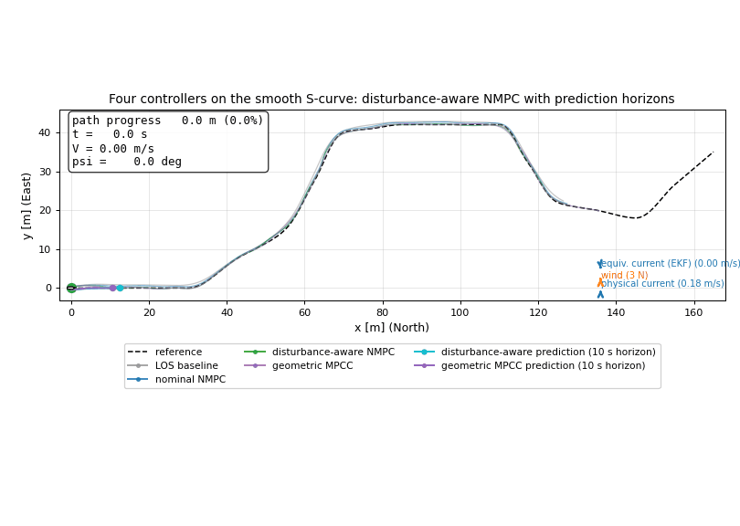
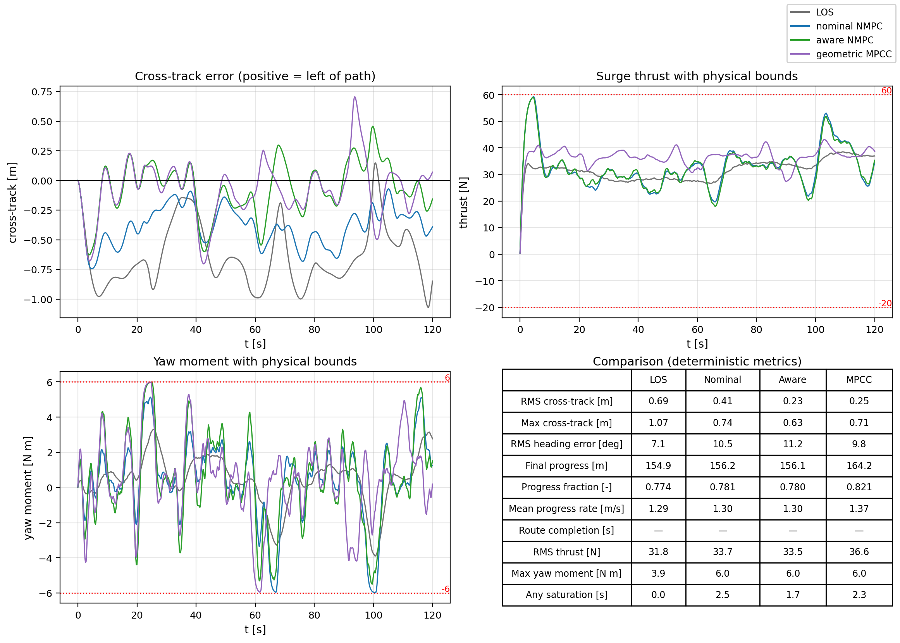
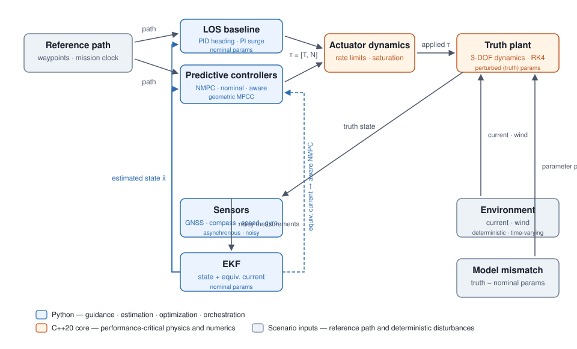

# Vessel-GNC

[](https://github.com/cdhainaut/vessel-gnc/actions)
[](LICENSE)
[](pyproject.toml)
[](CMakeLists.txt)

C++/Python simulation, estimation and nonlinear control for autonomous
surface vessels.



*An autonomous surface vessel follows an S-curve reference path under a
rotating current and wind gusts that are not supplied directly to the
controller. The vessel is controlled from EKF estimates of noisy sensors;
the cyan lines are the disturbance-aware NMPC's 10 s predictions, re-solved
at 5 Hz.*

**3-DOF dynamics · EKF · LOS/PID · disturbance-aware NMPC · C++20 · CasADi**

## Measured performance

<!-- generated:reference-benchmark-v1:start -->
| Metric | Result |
|---|---:|
| C++ RK4 propagation (vessel + actuator) | **742.8 ns/step** |
| 1000 s simulation (Python loop) | **657 ms** |
| Nominal NMPC mean / median / p95 / max [ms] | **30.0 / 27.4 / 48.8 / 91.0** |
| Disturbance-aware NMPC mean / median / p95 / max [ms] | **30.6 / 27.6 / 44.6 / 81.7** |
| Disturbance-aware MPCC mean / median / p95 / max [ms] | **55.7 / 48.0 / 102.8 / 370.8** |

Machine-dependent wall-clock measurements recorded in `results/reference/benchmark.json` (`benchmark_v3`, 900 predictive solves, 0 failed). Per-workload status histograms: Nominal NMPC: 300 samples, 0 failed, Solve_Succeeded=300; Disturbance-aware NMPC: 300 samples, 0 failed, Solve_Succeeded=300; Disturbance-aware MPCC: 300 samples, 0 failed, Solve_Succeeded=300. The 5 Hz control period defines a 200 ms budget; these solve times make no real-time capability claim. Regenerate with `python tools/generate_reference_results.py`.

<!-- generated:reference-benchmark-v1:end -->

Deterministic tracking and estimator metrics are kept strictly separate from
these wall-clock numbers: they live in `results/reference/metrics.json` and
are reproduced in the [Demo](#demo) table and in `docs/control.md`,
`docs/estimation.md` and `docs/validation.md`.

## Demo

The flagship scenario uses noisy asynchronous sensors, perturbed **truth
parameters**, a rate-limited actuator, rotating current and wind gusts. The
controller and EKF use the nominal model and never receive the true state or
environment. The EKF estimates vessel state plus a current-equivalent velocity;
in this combined-uncertainty run that augmented state can absorb wind and model
mismatch. The disturbance-aware NMPC consumes this estimate explicitly and
holds it constant over the prediction horizon; nominal NMPC predicts zero
disturbance. `examples/04_ekf.py` isolates physical-current estimation by
removing the confounders (docs/estimation.md).

<!-- generated:reference-controller-comparison-v1:start -->
| Metric | LOS (PID/PI) | Nominal NMPC | Aware NMPC | Aware MPCC |
|---|---:|---:|---:|---:|
| RMS cross-track error [m] | 0.69 | 0.41 | 0.23 | 0.25 |
| P95 cross-track error [m] | 0.98 | 0.65 | 0.53 | 0.61 |
| Max cross-track error [m] | 1.07 | 0.74 | 0.63 | 0.71 |
| RMS wrapped heading error [deg] | 7.1 | 10.5 | 11.2 | 9.8 |
| Max wrapped heading error [deg] | 20.4 | 27.7 | 31.7 | 29.1 |
| Final path progress [m] | 154.9 | 156.2 | 156.1 | 164.2 |
| Final path progress fraction [-] | 0.774 | 0.781 | 0.780 | 0.821 |
| Mean progress rate [m/s] | 1.29 | 1.30 | 1.30 | 1.37 |
| Route completion [s] | — | — | — | — |
| RMS applied thrust [N] | 31.8 | 33.7 | 33.5 | 36.6 |
| Max applied thrust [N] | 38.5 | 59.2 | 59.1 | 43.1 |
| RMS applied yaw moment [N m] | 1.5 | 2.2 | 2.5 | 2.3 |
| Max applied yaw moment [N m] | 3.9 | 6.0 | 6.0 | 6.0 |
| Thrust saturation duration [s] | 0.0 | 0.1 | 0.0 | 0.0 |
| Yaw-moment saturation duration [s] | 0.0 | 2.4 | 1.7 | 2.3 |
| Either channel saturated [s] | 0.0 | 2.5 | 1.7 | 2.3 |

Deterministic flagship metrics formatted from `results/reference/metrics.json` (scenario `scenario_v3_mpcc`, revision 1, seed 42, 120.0 s at 0.01 s integration). Route completion is the first sample at 99% of total chord progress; an incomplete route is shown as —. Saturation counts left-closed intervals whose applied value lies within 1% of a `ModelParams` bound span (docs/validation.md). No wall-clock timing appears here: predictive solve times are machine-dependent and reported separately in the benchmark table.

<!-- generated:reference-controller-comparison-v1:end -->

The table exposes the complete trade-off: tracking, heading alignment,
actuator use and saturation for all three controllers. Every number is
formatted from the committed reference artifacts — no cherry-picked values.



## Architecture



The C++20 core owns the performance-critical kernel (3-DOF dynamics, RK4
integration, PID/PI baseline controllers); Python owns guidance, the EKF,
the NMPC, orchestration and visualization. The NMPC prediction model is an
independent CasADi implementation of the same equations, cross-validated
against the C++ kernel with non-zero current and wind (max diff < 1e-8).

## Uncertainty-aware control

The reference scenario already runs the full chain — physical model,
simulation, estimation, optimal control — under disturbances that the
controllers do not see:

- actuator dynamics with saturation and rate limits;
- separate nominal (controller) and truth (plant) models with parameter
  mismatch;
- a time-varying rotating current with wind gusts; the augmented EKF state is
  validated as physical current in an isolated case and reported as an
  equivalent-current proxy under combined uncertainty (docs/estimation.md);
- nominal versus **disturbance-aware NMPC**, with the estimate passed explicitly
  into the predictor and quantitative benefit/cost reported below;
- scenario-based robust NMPC propagating several model variants under one
  common control sequence (future work);
- Monte-Carlo evaluation of LOS vs nominal NMPC vs robust NMPC (future
  work).

No RL, PINNs or neural networks: the differentiator is quantitative
robustness analysis of physics-based control.

## Reference results

Committed, versioned artifacts — the sole numerical source of truth:

- `results/reference/config.json` — the full scenario configuration
  (parameter values, not digests, including nominal and truth plant sets);
- `results/reference/metrics.json` — deterministic tracking and estimator
  metrics, no timing;
- `results/reference/benchmark.json` — machine-dependent benchmark timing;
- `results/reference/metadata.json` — software/platform versions, source
  fingerprint and artifact hashes;
- `assets/hero.gif`, `assets/controller_comparison.png`,
  `assets/current_estimation.png` — flagship assets, regenerated from the
  same reference run.

The example scripts additionally write their own figures into `results/`
(open-loop animation, heading step, LOS path following, EKF estimation,
NMPC trajectories).

`results/reference/config.json`, `results/reference/benchmark.json` and
`results/reference/metadata.json` record the repository state **at
generation time** — honest provenance, not a claim about the current
checkout. The authoritative consistency check is the content-based source
fingerprint; the full reproducibility contract (`--check`,
`--verify-determinism`, tolerances, generation environment) and the metric
definitions are documented in `docs/validation.md`.

<!-- generated:reference-provenance-v1:start -->
| Item | Value |
|---|---|
| Scenario | `scenario_v3_mpcc` (revision 1) |
| Seed | 42 |
| Duration / integration step | 120.0 s / 0.01 s |
| Controllers | `los_pid_v1` · `nominal_nmpc_v1` · `disturbance_aware_nmpc_v1` · `disturbance_aware_mpcc_v1` |
| Estimator | `augmented_current_ekf_v1` |
| Schema | `results/reference/reference.schema.json` (version 3) |
| Deterministic metrics | `results/reference/metrics.json` |
| Machine-dependent benchmark | `results/reference/benchmark.json` |
| Generated at (UTC) | 2026-09-27T19:42:39+00:00 |
| Source commit | `dec0802642417ed3b5f1eaf86f131926fdc591c5` |
| Source fingerprint | dirty: true · `3e710ef8ccd36660a31b388eb7f68ea2bc329af5e463893e1b18621c7f2ac367` |

Provenance rows are generation-time records; the content-based source fingerprint is the authoritative consistency check. The full reproducibility contract and the metric definitions live in the validation documentation.

<!-- generated:reference-provenance-v1:end -->

## Model

3-DOF horizontal-plane manoeuvring model — a Fossen-inspired formulation,
docs/model.md:

```text
eta = [x, y, psi]^T          nu = [u, v, r]^T
eta_dot = R(psi) nu
M nu_rel_dot + C(nu_rel) nu_rel + D(nu_rel) nu_rel = tau + tau_env
```

The implementation retains body-frame transport of an inertially constant
current and documents the quasi-steady approximation for the slowly varying
scenario in `docs/model.md`. It uses diagonal mass/added mass,
Coriolis/Munk coupling and linear + quadratic damping. Parameters are
**illustrative**, not identified from a specific hull.

## Software

| Path | Responsibility |
|---|---|
| `include/vessel_gnc/`, `src/` | C++20 core: state, dynamics, integrator, controllers, pybind11 binding |
| `python/vessel_gnc/` | Simulation, guidance, metrics, sensors, EKF, NMPC, plotting, reference runner |
| `tools/` | Reference artifact generation/check tooling |
| `examples/` | Five runnable scenario scripts |
| `tests/` | C++ (GoogleTest) and Python (pytest) tests |
| `benchmarks/` | Reproducible performance benchmarks |
| `docs/` | Model, control, estimation and validation documentation |

## Running the demo

Requirements: CMake ≥ 3.20, a C++20 compiler, Python ≥ 3.12.

```bash
pip install -e .        # builds the C++ core via CMake (scikit-build-core)
python examples/05_nmpc_demo.py    # flagship: NMPC vs LOS + hero animation
```

Reference artifacts:

```bash
python tools/generate_reference_results.py            # full generation (120 s flagship + benchmark)
python tools/generate_reference_results.py --check    # cheap consistency validation (no simulation)
```

Other examples:

```bash
python examples/01_open_loop.py        # open-loop run + animated scene
python examples/02_heading_control.py  # heading step response
python examples/03_path_following.py   # LOS path following + metrics
python examples/04_ekf.py              # EKF estimation in the loop
```

C++-only build and tests:

```bash
cmake -B build && cmake --build build
ctest --test-dir build
```

Benchmarks:

```bash
python benchmarks/benchmark_simulation.py
cmake -B build -DVESSEL_GNC_BUILD_BENCHMARKS=ON && cmake --build build
./build/benchmark_core
```

## Validation

- the full per-case record lives in `docs/validation.md`; the C++
  (GoogleTest) and Python (pytest) suites run in CI;
- analytical and convergence validation (RK4 order, surge equilibrium, yaw
  balance, current equilibrium, EKF no-noise consistency);
- cross-validation of the CasADi NMPC model against the C++ kernel;
- deterministic simulations: seeded randomness everywhere, with an explicit
  one-run determinism check (`python tools/generate_reference_results.py
  --verify-determinism`).

## Documentation

- `docs/model.md` — reference frames, equations, environment model,
  parameters and approximations.
- `docs/control.md` — baseline controllers, LOS guidance and the NMPC
  formulation (weights, sub-stepping, warm start).
- `docs/estimation.md` — augmented EKF formulation (vessel + current),
  sensor model and the disturbance-estimation validation.
- `docs/validation.md` — the full validation record.

## Roadmap

- scenario-based robust NMPC and Monte-Carlo evaluation;
- coastal navigation environment for the flagship visual.

## References

- Fossen, *Handbook of Marine Craft Hydrodynamics and Motion Control* (2011).
- Rawlings, Mayne, Diehl, *Model Predictive Control: Theory, Computation,
  and Design* (2020).
