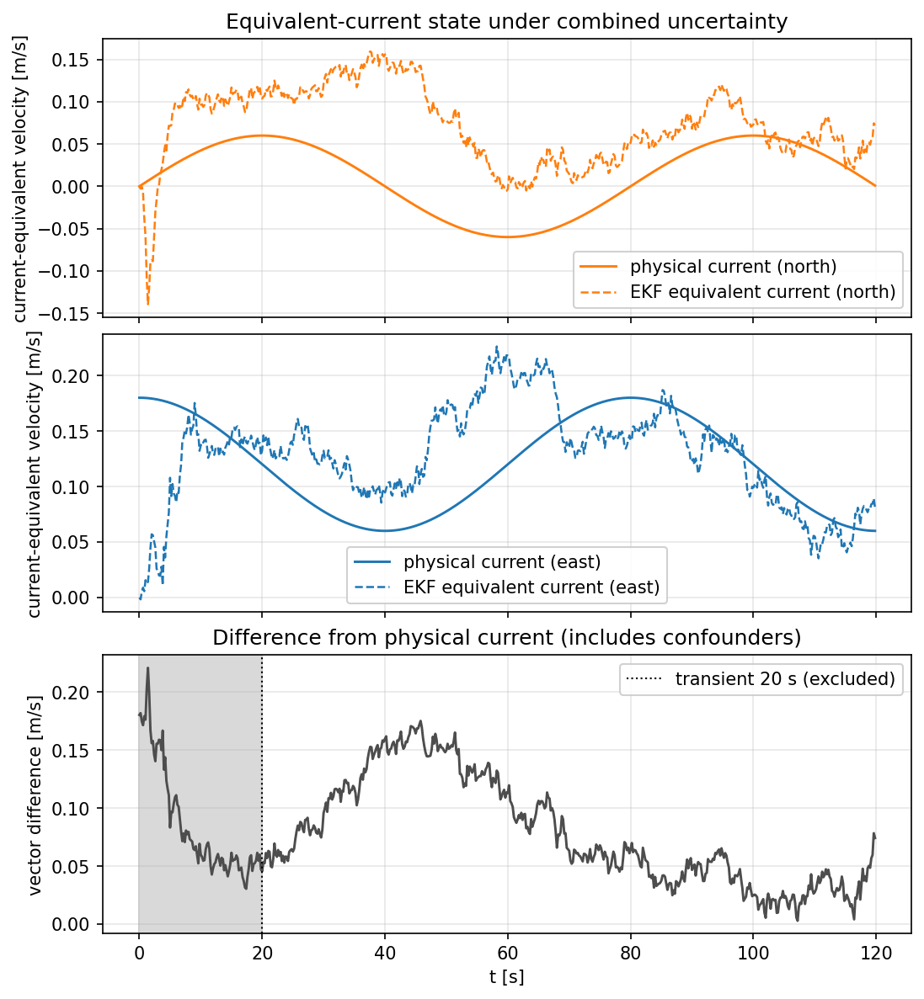

# State estimation — EKF with asynchronous noisy sensors

The filter lives in `python/vessel_gnc/ekf.py`, the sensor models in
`python/vessel_gnc/sensors.py`. All SI units, angles in radians.

## 1. Filter state and architecture

The filter is **augmented**: the vessel state (docs/model.md §1) plus two
inertial current-equivalent velocity components, which evolve as a slowly
varying random walk:

```text
x = [x, y, psi, u, v, r, V_cx, V_cy]^T
```

```text
noisy sensors ──► EKF ──► x_hat ──► LOS guidance + PID/PI ──► [T, N] ──► vessel
     ▲                                                                   │
     └────────────── noisy measurements ────────────────────────────────┘
```

The filter runs at the control rate (10 Hz in example 04). The controller
uses the **estimate**, not the true state — the plant's state is never seen
directly. The two augmented components are available through
`current_estimate`; `equivalent_current_estimate` is the explicit alias used
by the combined-uncertainty flagship.

Their physical meaning depends on the experiment:

- **current-only validation** (`examples/04_ekf.py`): plant and filter share the
  nominal model and wind is disabled, so `(V_cx, V_cy)` represents physical
  ambient current;
- **flagship mismatch + gusts** (`examples/05_nmpc_demo.py`): unmodelled wind
  and hydrodynamic mismatch can also drive the state, so it is reported as an
  **equivalent-current proxy**, not a current sensor.

## 2. Sensor model

| Sensor | Measures | Rate (default) | Noise σ (default) |
|---|---|---|---|
| GNSS | `(x, y)` | 5 Hz | 0.5 m per axis |
| Compass | `psi` (wrapped to (-pi, pi]) | 10 Hz | 0.0175 rad (1°) |
| Speed log | `u` | 10 Hz | 0.05 m/s |
| Gyro | `r` | 10 Hz | 0.01 rad/s |

Noise is zero-mean Gaussian, sampled with `np.random.default_rng(seed)` — all
runs are reproducible. Periods are configurable (`SensorConfig`); `None`
disables a sensor.

Note: the sway velocity `v` has **no direct sensor**; it is observed only
through the dynamics (position coupling) and the other measurements.

## 3. Filter equations

**Prediction** — the discrete state transition is the C++ RK4 kernel itself
(no duplicated dynamics in Python). The command goes through the nominal
actuator model first (docs/model.md §5); the resulting applied forces drive
the vessel prediction, and the filter carries the nominal actuator state as
a known quantity (deterministic given the command history). The vessel block
is evaluated with the **estimated current** as the relative-velocity
reference (`Environment(current= x[6:8])`), so the filter model is the same
equations as the plant, with the current as an unknown input:

```text
x_hat^- = rk4_step(x_hat, u, env_nominal, dt)
P^- = F P F^T + Q
```

with `F` the Jacobian of the discrete map by central finite differences and
`Q = diag(q)` a diagonal per-step process-noise covariance. More precisely,
the prediction environment is
`Environment(current=x[6:8], wind=0)`: the filter does not receive the true
current or wind, but its own augmented current-equivalent state enters the
relative-velocity dynamics. Remaining model error is covered by `Q`.

**Update** — all measurements are linear observations of state components
(`H` is a selection matrix), updated in Joseph form with explicit
symmetrization:

```text
S = H P^- H^T + R
K = P^- H^T S^-1
x_hat = x_hat^- + K (z - H x_hat^-)
P = (I - K H) P^- (I - K H)^T + K R K^T
```

The compass innovation is wrapped to (-pi, pi] before the update, so a
heading crossing the ±π boundary produces no spurious transient.

Default noise parameters (per-step variances): `q = [1e-4, 1e-4, 1e-5, 5e-4,
2e-3, 5e-5, 4e-5, 4e-5]` (position, heading, surge, sway, yaw rate, current
walk) and initial covariance
`P0 = diag(1, 1, 1e-2, 0.25, 0.25, 1e-2, 1e-2, 1e-2)` (augmented components
uncertain to 0.1 m/s). The random-walk variance covers the slow scenario
rotation and, in the flagship only, the apparent-current effect of unmodelled
wind and parameter mismatch.

## 4. Validation record

Automated in `tests/test_ekf.py`:

| Case | Method | Result |
|---|---|---|
| Sensor schedule | Firing rates and measurement availability over time | Pass |
| Noise statistics | Sample std within 20% of the configured σ (gyro) | Pass |
| Compass wrapping | Output in (-pi, pi] for a 4 rad heading | Pass |
| Covariance symmetry | P = Pᵀ, positive definite, finite over a noisy run | Pass |
| No-noise consistency | Exact model, near-zero R: the 8-state estimate converges to the truth (< 1e-3) | Pass |
| Physical-current estimation | Exact nominal plant/filter, rotating current, no wind, 120 s | Post-transient RMS current error < 60 mm/s (seed 7) |
| Combined-uncertainty tracking | LOS + PID on EKF estimates, current + wind unknown, 120 s | RMS position error < 3 m, max < 6 m |

The flagship scenario (`scenario_v1_mismatch_disturbance`, revision 1,
seed 42) records the callback-aligned EKF estimates of the NMPC reference
run. The deterministic estimator errors below are formatted from
`results/reference/metrics.json`; current-vector statistics discard the
explicit 20.0 s transient.

<!-- generated:reference-estimator-v1:start -->
| Metric | Value |
|---|---:|
| Position error RMS [m] | 0.16 |
| Position error max [m] | 0.43 |
| Yaw-rate error RMS [rad/s] | 0.008 |
| Equivalent-current difference RMS [m/s] (after 20.0 s transient) | 0.090 |
| Equivalent-current difference max [m/s] (after 20.0 s transient) | 0.175 |

Estimator errors of the NMPC reference run, computed from the callback-aligned true/estimated records and formatted from `results/reference/metrics.json` (scenario `scenario_v1_mismatch_disturbance`, seed 42). In this combined-uncertainty run the augmented state is an equivalent-current proxy: wind gusts and model mismatch can shift it away from the physical current. The difference reported here quantifies that confounding (docs/estimation.md §5); the isolated current-only validation is reported separately.

<!-- generated:reference-estimator-v1:end -->



The figure above belongs to the combined-uncertainty flagship and shares its
exact scenario and seed. It deliberately contrasts physical current with the
EKF equivalent-current state; their difference includes wind and model-mismatch
confounding. Run `examples/04_ekf.py` for the isolated physical-current
validation without those confounders.

## 5. Known limitations

- Outside the current-only validation, the augmented state absorbs **all**
  unmodelled environmental forces: wind gusts and parameter mismatch appear
  as equivalent-current bias. The position estimate stays accurate thanks to
  GNSS.
- Physical current is only observable through vessel motion: in a perfectly
  straight constant-speed run it is weakly excited and the estimate
  converges slowly.
- Diagonal Q/R only (no cross-correlations); adequate at this noise level.
- The Jacobian is recomputed by finite differences every step (12 extra RK4
  evaluations at 10 Hz — negligible cost, robust to model changes).
